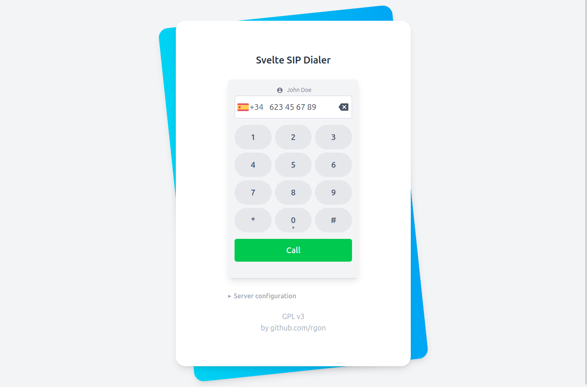

# svelte-sip



SIP Caller component built with svelte and SIP.js

## Usage
Access the live demo with `pnpm run dev`
```svelte
<SvelteSIP
    defaultCountries={['ES', 'US']}
    getSipCallUri={(phoneNumber) => `sip:${phoneNumber}@sip.example.com`}
    sipServer="wss://edge.sip.onsip.com"
    sipOptions={{
        aor: "sip:johndoe@sip.example.com",
        userAgentOptions: {
            authorizationUsername: 'johndoe',
            authorizationPassword: 'sectret'
        },
        media: {
            constraints: {
                audio: true
            }
        }
    }} />
```

## Acceptance criteria
Step 1: UI
+ [x] UI: modern, similar to Android/iOS calling
+ [x] UX: longpress inpup
+ [x] UI: caller ID
+ [x] UX: keep input focused after pressing keyboard buttons
+ [x] UX: svelte phone validation (country etc)
+ [x] Split into phoneInputComponent -> export enter event
+ [x] feat: country search
+ [x] feat: SIP Limit calling countries by code
+ [x] config: contact options, bind value, control:{setPhoneNumber, call}
    interface Props {
        onCall?: (phoneNumber: string) => void;
        phoneNumber?: string;
        phoneNumberValid?: boolean;
        validationError?: string;
    }
+ [x] UI: currently calling view with blur. Mute/statistics/hold/transfer
+ [x] Implement Sip.js: settings & initialization
+ [x] Basic server connection. Server connection information.
+ [x] retry server connection
+ [x] place call method
+ [x] hangup method
+ [x] handle call events. Handle call time
+ [x] Implement control, Event callbacks
+ [x] Fix ui animations @ call flow
+ [x] env authentication for demo server
+ [x] UX: determine if call finally established or not
+ [x] add default country

Step 2: Functionality
+ [ ] sip proxy minimal working example.
    + [ ] programatic secrets secrets/yaml editing

+ [ ] incoming call UI and implementation
        await sipUser?.answer();
    + [ ] animated screen

+ [ ] dialer while call for DTMF

+ [ ] UI: clear phone number after call (prevent retry click)
+ [ ] Recents list UI (fetchRecents option) -> view user recents (?) optional

+ [ ] backend minimal example
    + [ ] activate debug logging
+ [ ] fetch credentials from env
+ [ ] example env file

## Backend setup notes
Please note that you will need a sip account on a server that supports SIP over websockets. Test if your provider allows that. If not, you may need to setup a PBX or SIP router to manage your calls.

To get this, you have a few options:
+ Signalling servers: routr, kamailio... Do not proxy audio, just signalling, and offer a direct connection to the server (trigger a P2P exchange between web client and SIP server). May require setting up TURN/STUN signalling servers/proxies for WebRTC to work in all networks.
+ Hosted service: onsip
+ Full PBX servers: asterisk, freeswitch, kamailio with siwpise rtpengine (see https://github.com/florian-h05/webrtc-sip-gw/)

### Freeswitch
GOTCHAS:
+ If you maintain default passwords, there'll be a delay. See https://stackoverflow.com/a/32801223
```
edit the /conf/vars.xml and change the default password 1234 to new password.
```